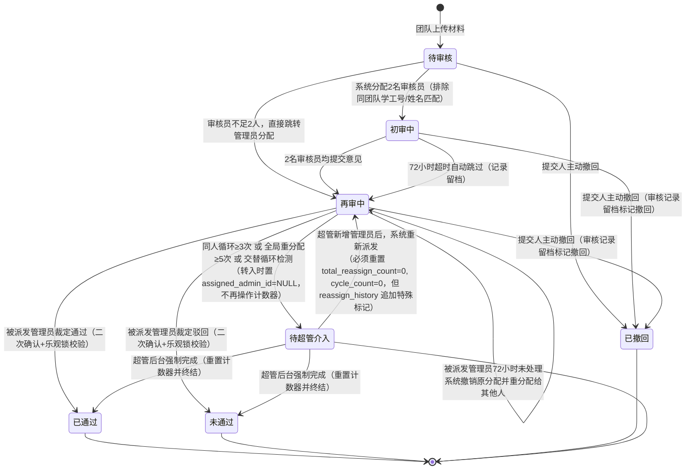

# 材料协同审核平台 产品设计文档

---

## 1. 产品概述

### 1.1 背景与目标
本系统服务于**单一专项项目**的材料审核工作（如报销材料、申报材料等），为短期专项服务，不存在多项目并行导致的业务冲突问题。

当前报销审核依赖碎片化沟通，流程割裂。本平台旨在搭建一站式的内部Web审核工作台，实现“团队提交材料 → 双人随机初审（超时自动跳过） → 管理员智能派发终审（超时自动换人） → 结果反馈”的标准化流程。

**核心原则**：
- **极简提交**：提交人只需上传文件，无需填写复杂表单。
- **独立盲审**：初审员全程匿名，意见互不可见，保证客观。
- **即时反馈**：审核结果通过邮件即时触达，详情登录平台查看。
- **智能调度**：基于当前负载与历史贡献的双重排序分配任务，确保工作量长期均衡；超时人员将被降权处理。
- **自动容错**：任何环节超时（72小时）自动转派或跳过；终审环节引入**双阈值兜底机制**（同人循环≥3次 **或** 全局重分配≥5次 **或** 交替循环检测），自动升级为“超管待介入”状态，彻底杜绝无限循环死锁，确保流程永不卡顿且运维可感知。
- **提交人视图简化**：提交人端进度看板不再展示繁琐的内部流转状态（待审核/初审中/再审中），统一归纳为 **“审核中”**；当工单因系统异常挂起时，展示为 **“加急处理中”**，仅当流程终结（通过/未通过/已撤回）时展示最终结果，极大降低沟通成本与用户焦虑。

### 1.2 部署方案
采用**公有云服务器（方案一）**部署，所有用户通过公网IP/域名直接访问，无需VPN。服务器由管理员维护，数据库与文件存储均位于云端。

---

## 2. 术语与概念定义

| 术语 | 定义 | 执行角色 |
| :--- | :--- | :--- |
| **审核员** | 负责第一层审核（初审），由系统按双重排序算法分配的2名普通审核员执行。<br>**规避规则**：系统优先匹配审核员的 `student_id`（学工号）是否存在于提交团队的 `member_student_ids`（成员学工号列表）中，若存在则排除；若 `student_id` 为空或未匹配，则降级为标准化后的 `real_name` 匹配（去空格、全半角统一），确保同团队成员不互审。<br>**注**：允许同一学工号出现在多个团队（一人多团队）或不属于任何团队，分配时**逐工单**进行碰撞检测。若因重名或标准化问题导致候选池不足，系统将向超级管理员发送告警邮件（含排除明细）。 | 审核员 |
| **管理员** | 负责最终裁定（再审），由系统按双重排序算法分配**1名管理员**执行裁定，**不参与后台管理与配置**。<br>**注**：管理员默认独立于各团队之外，**不参与同团队规避逻辑**（终审派发无回避判断）。 | 管理员 |
| **超级管理员（超管）** | **拥有平台全部后台管理权限**，负责用户管理、密码重置、全部工单管理与干预、邮件日志查看与补发、系统配置等。**不参与任何审核任务派发**。 | 超级管理员 |
| **当前待办数** | 当前时刻分配给该用户但尚未完成的工单数量（`current_pending_count`） | 审核员 / 管理员 |
| **累计完成数** | 该用户在系统中历史处理完成（含通过/驳回）的工单总数量（`total_completed_count`） | 审核员 / 管理员 |
| **系统强制惩罚因子** | 超管强制完成的工单不计入任何人工作量，但会在算法排序时虚拟增加该管理员的负载基数（`system_forced_penalty * 100`）。**若超管覆盖了管理员已提交的终审意见，该管理员的 `total_completed_count` 需回退 -1，同时 `system_forced_penalty` +1**，以平衡隐性不公。 | 系统 |
| **双重排序分配算法** | 优先选择 **当前待办数最小** 的人员；若并列，则选择 **累计完成数 + 系统强制惩罚因子虚拟值** 最小的人员（照顾新人或工作量少者）；若某管理员刚超时，其排序权重临时垫底 | 系统 |
| **第X次提交** | 系统按“团队账户”维度自动累计的提交序号，用于管理员追溯审核历史 | — |
| **超时重分配** | 管理员被派发终审任务后 **72小时内未处理**，系统自动撤销其任务并重新分配给另一位管理员（原管理员被降权）。<br>**双阈值兜底**：若同人循环派发**≥3次**，或全局重分配总次数**≥5次**，或**交替循环检测**（`total_reassign_count ≥ 3` 且历史派发管理员去重数 ≤ 2），系统将工单升级为“待超管介入”状态，强制人工兜底。<br>**并发安全**：所有写操作遵循 **应用层分布式锁**（以 `submission_id` 为键）搭配乐观锁（`version`），确保同一工单的写操作串行执行；Cron 使用 `SELECT FOR UPDATE SKIP LOCKED` 配合 CTE 避免死锁。 | 系统 |
| **审核结论可撤回期** | 审核员提交初审意见后、管理员做出终审裁定前，审核员可撤回自己的初审结论并重新提交。**一旦管理员提交了终审意见，审核员即不可再撤回。**<br>**补时逻辑区分场景**：<br>1. 若当前有效初审意见数 **< 2**（即仅1人或无人提交），撤回时若剩余时间<3小时，则**仅延长该审核员的个人截止时间（`staff_reviews.personal_deadline`）+3小时**，消耗该审核员的 `delay_used` 额度（另一人的截止时间不受影响）。<br>2. **若当前有效初审意见数已 = 2**（即两位审核员均已提交），撤回时**截止时间不再后移**，提示“二审已完成，撤回后请尽快重新提交，超时将记为未审”。<br>并发安全增强：补时操作在事务内完成并同步触发超时判定。 | 审核员 |
| **成员名单（member_names）** | 录入团队账户时，**必须录入该团队所有成员的真实姓名（上限12人）**，存储为JSON数组。系统入库时自动执行**去空格、全半角统一、Trim**标准化处理，同时保留原始录入值（`member_names_raw`）备查。该名单仅用于初审分配时的人员碰撞检测（基于姓名精确匹配）。 | 超级管理员 |
| **成员学工号（member_student_ids）** | 录入团队账户时，**必须同时录入该团队所有成员的唯一学工号（上限12人）**，与 `member_names` 一一对应，存储为JSON数组。初审分配时**优先使用学工号进行碰撞检测**，大幅降低重名误杀率。<br>**取消全局唯一约束**：允许同一学工号出现在多个团队（一人多团队）或不属于任何团队，分配时**逐工单**匹配当前提交团队的 `member_student_ids`。<br>**注**：审核员/管理员的 `student_id` 可与团队成员的 `student_id` 重复（仅审核员之间需唯一），系统碰撞检测时将审核员的 `student_id` 与团队列表进行比对。 | 超级管理员 |

## 2.1 状态定义（内部状态机 vs 提交人可见UI）

| 内部状态码 | 含义 | **提交人端UI展示** |
| :--- | :--- | :--- |
| pending | 已提交，等待系统分配审核员（该状态下可撤回） | **审核中** |
| first_reviewing | 已分配2名初审员，等待意见（该状态下可撤回） | **审核中** |
| admin_reviewing | 初审完成（或超时/人数不足跳过），等待管理员终裁（该状态下可撤回） | **审核中** |
| passed | 管理员裁定通过，流程终结 | **已通过** |
| rejected | 管理员裁定驳回，流程终结 | **未通过** |
| withdrawn | 提交人在审核完成前主动撤回，所有审核记录留档标记为“团队撤回” | **已撤回** |
| **pending_admin_intervention** | **终审环节因同人循环超限（≥3次）、全局重分配耗尽（≥5次）或交替循环导致系统自动挂起，等待超级管理员后台人工干预** | **加急处理中**（用户端显示此文案，点击详情提示“系统正在加急处理，请耐心等待”，隐藏技术细节）。**撤回按钮不可用（后端强制拦截）** |

---

## 3. 用户角色与权限

系统采用**三级权限体系**：

| 角色 | 数量 | 职责与权限范围 |
| :--- | :--- | :--- |
| **提交人（团队）** | 若干 | 上传材料附件（及可选说明），查看进度与结果，审核完成前可撤回。<br>**录入要求**：超级管理员录入团队时，必须填写成员真实姓名列表（JSON数组）及对应的学工号列表（JSON数组），**上限12人**。 |
| **审核员** | 约10名 | **仅限初审**：执行系统派发的初审任务，给出通过/不通过意见及文字说明。 |
| **管理员** | 若干名（≥2） | **仅限再审**：对系统派发的工单做最终裁定（通过/驳回）。**不参与任何后台管理功能。** |
| **超级管理员** | 1~2名 | **拥有全部后台管理权限**，包含：用户管理、密码重置、全部工单管理及干预、邮件日志查看与补发、系统配置。**不参与任何审核任务派发（不会被分配初审或终审工单）。** |

**账号管理**：所有账号由超级管理员在后台提前录入，录入团队账密时**同时录入该团队成员名单（上限12人）及对应学工号**。用户通过预置账号密码登录，不开放自主注册。

**账号安全策略**：
- **首次登录强制改密**：用户首次登录时，系统强制跳转至修改密码页面，初始密码为超管预设的临时密码（8位随机字符串，含大小写字母+数字+特殊字符）。
- **密码复杂度要求**：密码长度不少于8位，须同时包含大写字母、小写字母、数字和特殊字符（如 `!@#$%^&*`）。
- **登录失败锁定**：连续5次登录失败后，账号锁定30分钟（自动解锁），超管可在后台手动解锁。**手动解锁时强制重置 `login_fail_count=0` 并置 `locked_until=NULL`**。锁定期间的所有登录尝试，系统返回“账户已锁定”且**不更新** `login_fail_count` 和 `locked_until`。
- **超管账号**：不强制MFA，但超管所有敏感操作（密码重置、强制干预等）仍需二次输入自身登录密码确认身份。

**备注**：`users` 表中的 `team_id` 字段仅对 `role='team'` 有效（自引用），对审核员、管理员、超管该字段为 `NULL`，不用于关联所属团队。团队成员的匹配优先通过 `member_student_ids` 进行学工号碰撞检测（**逐工单匹配，允许一人多团队**），若学工号缺失则降级为 `member_names` 姓名匹配。

---

## 4. 核心业务流程（状态机流转）

每份材料均为**独立工单**，互不关联。系统按“团队账户”自动累计提交次数，用于管理员追溯审核历史链。团队提交后，在审核完成前**无法再次提交**，须等待未通过反馈或主动撤回。



**流程说明**：
1. 提交人上传材料（含可选说明），系统检测该团队是否有“未通过”的历史工单（若有，则提醒管理员关联追溯），状态变为“待审核”。**此时至审核完成前，提交人不可再次提交**（若存在“待审核/初审中/再审中/待超管介入”任一状态，均禁止新提交）。
2. 系统按**双重排序算法**指派2名审核员（**优先匹配学工号 `student_id` 是否存在于提交团队 `member_student_ids` 数组中，若未匹配则降级为标准化姓名匹配；逐工单碰撞，允许一人多团队**）。若过滤后候选池 < 2人，则跳过初审，`first_review_skip_reason`标记为`'insufficient_staff'`，直接进入再审，并触发超管告警邮件（含排除明细）。
3. 两位审核员各自独立提交意见。（提交后、管理员终审前，允许撤回重审；**一旦管理员提交了终审意见，撤回按钮即不可用**；补时逻辑区分场景：若两名审核员均已提交有效意见，撤回时不再延长任何人的截止时间；若仅1人或无人提交，则**仅延长撤回者个人的截止时间**（`staff_reviews.personal_deadline`），另一人不受影响；补时操作立即更新数据库并在同一事务内同步执行超时判定，确保定时任务不会误判）。
4. **触发条件（满足任一即进入再审）**：
   - 两位均提交意见 → 状态变为“再审中”
   - 任一审核员分配后**72小时未处理** → 系统记录该审核员“超时未审”，跳过初审环节，状态变为“再审中”。**若此时另一位审核员已提交意见，该意见保留，并在管理员端显示“初审完成度：1/2（审核员X超时未审）”**。
5. 系统按**双重排序算法**分配**1名管理员**执行终裁（状态变为“再审中”且绑定具体管理员ID）。**超级管理员不参与派发池，终审派发无回避判断**。
6. **管理员处理时限**：
   - 若被派发管理员在 **72小时内** 做出裁定（须二次确认 + 乐观锁校验）→ 状态变为“已通过/未通过”，流程终结。
   - 若被派发管理员 **72小时未处理** → 系统自动撤销该管理员的当前任务（**执行一次**`current_pending_count -1`，同时 `timeout_count +1`），其排序权重临时降低，同时 **`total_reassign_count` +1**，并将 `is_admin_pending_deducted` 置为 `TRUE`。**同时将 `assigned_admin_id` 置为 NULL**（释放关联）。
   - 若 `assigned_admin_id` 变更（换人），`cycle_count` **重置为0**；若未变更（仍派给自己），`cycle_count` **+1**。
   - **交替循环检测**：若 `total_reassign_count ≥ 3` 且历史派发管理员去重数（`DISTINCT(assigned_admin_id_history)`）≤ 2，系统判定为交替循环，**立即将工单置为“待超管介入”**，并强制置 `assigned_admin_id=NULL`。
   - **双阈值兜底判定**：
     - 若 `cycle_count ≥ 3` 或 `total_reassign_count ≥ 5`，系统**将工单状态置为“待超管介入”**，并强制置 `assigned_admin_id=NULL`。**转入该状态时，不再重复对当前管理员执行`current_pending_count -1`**（因为超时撤销时已扣减）。
   - 进入“待超管介入”后，超管后台首页置顶红色告警横幅（按工单逐条展示），强制要求超管人工干预。
7. 超管干预时（详见5.4），**必须重置**`total_reassign_count = 0`和`cycle_count = 0`；`reassign_history` **不清空**，而是在数组末尾追加一个特殊标记 `-1`（表示超管干预重置点），保留完整派发历史。同时新增 `intervention_reset_count` 字段记录超管重置次数。再执行“强制完成”或“重新派发”。若执行“强制完成”，需根据 `is_admin_pending_deducted` 判断是否需扣减管理员待办；若为 `FALSE`（如管理员不足直接挂起），则需扣减；若为 `TRUE`（已扣减），则跳过。
8. **工单终结清理**：工单状态变为 `passed`、`rejected` 或 `withdrawn` 时，系统**不再重置计数器**（保持历史值用于审计），但为了语义清晰，`cycle_count`、`total_reassign_count` 和 `reassign_history` 保留最终状态。同时将当前快照写入 `admin_audit_logs`。

**撤回说明**：
- **提交人撤回**：在任何审核阶段（待审核/初审中/再审中）均可撤回（**“待超管介入”状态下禁用撤回按钮，且后端强制拦截**），撤回后所有已完成的审核步骤无效化但**永久留档**，标记为“团队撤回材料”。**并发冲突处理**：后端采用**应用层分布式锁**（以 `submission_id` 为锁键，如 Redis `SET NX` 或 PostgreSQL 咨询锁）配合乐观锁（`version`字段），确保同一工单的写操作串行执行。撤回时自动释放管理员占用，若有审核员已提交意见，对应`total_completed_count`回退-1（仅当 `is_counted=TRUE`）。**若 `assigned_admin_id IS NOT NULL` 则扣减待办并置 `is_admin_pending_deducted = TRUE`；若为 NULL，则保持原值不变（不强行置 FALSE），以确保字段真实反映占用状态**。**后端撤回接口必须校验工单状态，若 `status = 'pending_admin_intervention'`，直接返回 403 错误，禁止撤回，不执行任何数据库写操作。**
- **审核员撤回初审结论**：审核员提交初审意见后、**管理员终审完成前**，可撤回自己的意见并重新提交。**一旦管理员提交了终审意见（`admin_reviews` 表存在记录），审核员即不可再撤回。**若当前时间**已超过该审核员的个人截止时间（`staff_reviews.personal_deadline`）**，系统禁止撤回并提示“任务已超时”；若未超时，则执行以下逻辑：
  - **场景A（有效意见数 < 2）**：若剩余时间不足3小时，系统将该审核员的 `personal_deadline` 后移3小时（**仅撤回者本人**），同时消耗该审核员的 `delay_used` 额度（另一人的截止时间不变）；若剩余时间 ≥3小时则截止时间不变。
  - **场景B（有效意见数 = 2）**：系统**不再延长任何人的截止时间**，提示“二审已完成，撤回后请尽快重新提交，超时将记为未审”。
  - **管理员端可见性**：审核员撤回意见后，管理员端的初审意见墙**完全隐藏**被撤回的意见（不显示任何痕迹），仅显示“该审核员尚未提交意见”，但数据库记录保留用于审计。
  - 并发安全增强：补时操作在事务内完成，**并同步执行一次超时判定**（复用Cron判定逻辑），确保与定时任务扫描不产生竞态。

---

## 5. 功能模块详细设计

### 5.1 提交人端

#### 5.1.1 新建提交（极简表单）

| 表单字段 | 类型 | 必填 | 说明 |
| :--- | :--- | :--- | :--- |
| 材料附件 | 文件上传 | **是** | 单文件上传，**大小限制 50MB**。<br>**支持格式**：所有常见压缩包格式（.zip / .rar / .7z / .tar.gz / .tgz 等）<br>**存储规则**：保留用户原始文件名，服务器仅添加 `{团队名完整哈希}_{团队ID}_{提交序号}_` 前缀（如 `a1b2c3d4e5f6g7h8_101_3_报销单.zip`），彻底杜绝中文乱码与路径遍历风险（后端过滤 `../` 等危险字符）。<br>**安全声明**：系统仅将压缩包作为二进制不透明文件存储，不进行解压、预览或扫描。 |
| 说明备注 | 多行文本框 | 否 | 可选，用于补充说明本次提交背景 |

- **提交限制**：若该团队存在“待审核/初审中/再审中/待超管介入”任一状态的工单，**不可再次提交**，须等待流程终结（通过/未通过）或主动撤回/超管处理完毕。
- **关联追溯**：若该团队存在状态为“未通过”的历史工单，且**最近一次提交的状态为“未通过”**，系统在提交页面顶部显示提示横幅：“检测到您此前提交的工单（#ID）未通过，管理员可在此次新提交中查看历史驳回记录。” 系统自动将新工单的 `parent_submission_id` 指向**最近一条未通过的根工单**（按 `created_at` DESC）。若历史未通过工单过于陈旧（超过30天或5次提交），则不再自动关联，改由管理员手动选择关联——**此句删除**，改为仅基于最近一次提交状态，不考虑时间或次数。
- **交互反馈**：点击“提交”后，仅提示 **“提交成功”**，无任何额外弹窗。
- **后台动作**：系统自动记录该团队累计提交次数（+1），并按命名规则存储文件。

#### 5.1.2 进度看板

列表展示该团队所有历史提交记录（含已撤回），包含：

| 字段 | 说明 |
| :--- | :--- |
| 提交序号 | 第X次提交 |
| 提交时间 | — |
| **状态（用户端）** | **展示四种状态**：**审核中** / **加急处理中** / 已通过 / 未通过 / 已撤回。<br>• 内部状态 `pending`、`first_reviewing`、`admin_reviewing` 统一映射为 **“审核中”**。<br>• 内部状态 `pending_admin_intervention` 映射为 **“加急处理中”**，点击详情提示“系统正在加急处理，请耐心等待”，**完全隐藏系统异常细节**。<br>• **注意**：当状态为“加急处理中”时，详情页底部不显示任何 `first_review_skip_reason` 的灰色小字提示。 |
| 附件 | 可下载原始文件 |
| 查看反馈 | 点击可查看最终审核结果与完整意见链（终审后可见） |
| 撤回操作 | - 内部状态为“待审核/初审中/再审中”时显示“撤回”按钮（即用户看到“审核中”时，若后台未终结，均可撤回），点击二次确认后撤回。<br>- **内部状态为“待超管介入”时，UI上完全隐藏“撤回”按钮，且后端接口强制拦截，返回403错误**（用户此时看到“加急处理中”，无法操作撤回）。 |

**流程透明度提示**：仅在“审核中”状态（内部状态为 `admin_reviewing`）且 `first_review_skip_reason` 非空时，在详情页底部显示灰色小字提示（不造成焦虑）：
- 若 `first_review_skip_reason='timeout'`：显示“初审员审核超时，材料已转交管理员复核”
- 若 `first_review_skip_reason='insufficient_staff'`：显示“材料审核流程已启动，请耐心等待”（不暴露内部人员不足问题）
- 若正常通过初审：不显示任何额外提示

#### 5.1.3 撤回操作

- **交互**：点击“撤回”按钮 → 弹窗二次确认：“确认撤回本次提交吗？已完成的审核意见将作废但会留档。” → 点击“确定”后完成撤回。
- **结果**：工单状态变为“已撤回”，所有已提交的初审/终审意见保留但标记为“团队撤回”。
- **后端强制拦截**：撤回接口首先校验工单状态，若 `status = 'pending_admin_intervention'`，直接返回 HTTP 403 错误，禁止撤回，不执行任何数据库写操作。
- **后端事务（含应用层分布式锁 + 乐观锁）**：撤回时，系统强制执行以下更新（事务内完成，先获取 `submission_id` 的分布式锁）：
  1. 获取锁后，校验 `version` 是否与页面加载时一致，若不一致则拒绝。
  2. `submissions.status` → `'withdrawn'`
  3. `submissions.assigned_admin_id` → `NULL`（释放管理员独占锁）
  4. **若 `assigned_admin_id IS NOT NULL`**（撤回前有管理员占用），则其 `current_pending_count` → `current_pending_count - 1`（前置校验确保 >0），并置 `is_admin_pending_deducted = TRUE`；**若 `assigned_admin_id IS NULL`**，则**保持 `is_admin_pending_deducted` 原值不变**（不强行置 FALSE），确保该字段真实反映是否已扣减过待办。
  5. **若有已提交意见的审核员（`staff_reviews.is_counted=TRUE`）**，对应审核员的 `total_completed_count` → `total_completed_count - 1`（意见作废，工作量回退）
  6. 工单 `version` 字段 +1（乐观锁自增）
  7. 触发工单终结钩子：不再重置 `delay_used`（保留历史状态）。

### 5.2 审核员端（初审）

#### 5.2.1 待办列表
- 仅显示分配给当前审核员且状态为 **“初审中”** 的任务。
- 列表展示：提交团队名称、提交序号、提交时间。
- **超时提醒**：距该审核员的个人截止时间（`staff_reviews.personal_deadline`）超过 **60小时** 的任务，列表中标红提示“即将超时”。

#### 5.2.2 审核操作（关键交互）

进入审核详情页：

- **页面布局**：顶部显示材料文件（可下载）与提交人备注（如有）。底部为审核操作区。
- **审核操作区**：同时展示 **“通过”** 和 **“不通过”** 两个按钮，正下方共用一个文本框。
- **辅助提示**：在按钮上方显示固定文案—— **“材料齐全请点击通过，材料不齐全/错误或存疑请点击不通过”**。

| 操作 | 交互细节 |
| :--- | :--- |
| 点击 **“通过”** | 1. 文本框内容**可选**（可为空）。<br>2. 弹出二次确认弹窗：“确认通过该材料吗？” → 点击“确定”后提交。<br>3. **提交后自动返回待办列表**。<br>4. 管理员终审完成前，审核员可撤回重审（详情见5.2.3）。 |
| 点击 **“不通过”** | 1. 文本框内容**必填**（不为空即可）。<br>2. 弹出二次确认弹窗：“确认不通过该材料吗？意见内容：XXX” → 点击“确定”后提交。<br>3. **提交后自动返回待办列表**。<br>4. 管理员终审完成前，审核员可撤回重审（详情见5.2.3）。 |

**超时兜底校验**：审核员提交意见时，后端首先判断当前工单是否已超时（基于该审核员的 `personal_deadline` 字段判定）。若已超时，接口直接返回错误“该任务已超时，请刷新页面”，并触发系统超时重分配流程。同时，在事务提交后，**强制调用一次超时判定函数**，确保若因并发导致提交瞬间超时，也能立即触发后续处理。

#### 5.2.3 撤回初审结论（重审机制）

- **触发条件**：审核员提交初审意见后、**管理员尚未完成终审裁定前**，可点击“撤回意见”按钮。**一旦管理员提交了终审意见（即 `admin_reviews` 表中存在该工单的记录），撤回按钮即不可用。**
- **前置校验**：若当前时间**已超过该审核员的 `personal_deadline`**，系统禁止撤回，提示“任务已超时，无法撤回”。
- **交互流程**：
  1. 点击“撤回意见” → 弹窗二次确认：“撤回后您可重新提交意见。确认撤回？”
  2. 确定后，该审核员的初审意见被清空（`staff_reviews.is_withdrawn = TRUE`，`is_counted = FALSE`），工单状态仍保持“初审中”。
  3. **计时器规则**：
     - 统计当前工单有效初审意见数（`is_withdrawn=FALSE` 且 `is_timeout=FALSE`）。
     - **若有效意见数 < 2**（即撤回后可能无法满足二审条件）：
       - 计算该审核员剩余时间 = `personal_deadline - NOW()`
       - 若 **剩余时间 ≥ 3小时**：`personal_deadline` 不变。
       - 若 **剩余时间 < 3小时** 且 **> 0**：
         - 检查该审核员是否已对该工单触发过延时（查 `staff_reviews.delay_used`）。
         - **若未触发过**：系统将该审核员的 `personal_deadline` 更新为 **`personal_deadline + INTERVAL 3 HOUR`**（仅延长撤回者本人），并将该审核员的 `delay_used` 置为 `TRUE`。**此操作在事务内完成并立即提交，同时在同一事务内同步执行一次超时判定**。
         - **若已触发过**：截止时间**不再后移**，提示用户“延时额度已用完，请尽快提交，逾期将记为超时”。
     - **若有效意见数 = 2**（即两位审核员均已提交）：
       - 系统**不再延长任何人的截止时间**，提示“二审已完成，撤回后请尽快重新提交，超时将记为未审”。
  4. **强制即时超时判定**：无论是否延时至，事务提交前均调用 `check_and_handle_timeout(submission_id)`，若当前时间已超过该审核员的 `personal_deadline`，立即触发超时跳过逻辑。
- **超时后果**：若超时前未能重新提交，则该审核员记为“超时未审”，已撤回但未重审的记录标记为“撤回未重审-超时”。
- **页面展示**：在审核详情页顶部显示提示横幅：“您已撤回初审意见，请于 X 小时 X 分内重新提交，否则将记为超时未审。”（基于该审核员的 `personal_deadline` 计算）
- **管理员端可见性**：审核员撤回意见后，管理员端的初审意见墙**完全隐藏**被撤回的意见，不显示任何“已撤回”痕迹，仅显示“该审核员尚未提交意见”，确保管理员不会对审核员产生偏见。

**有效意见计数规则**：系统判定“2名审核员均提交意见”时，仅统计 `staff_reviews` 中 `is_withdrawn=FALSE` 且 `is_timeout=FALSE` 的记录。若一位审核员撤回后未重审且超时，该工单按超时跳过初审处理（另一位已提交的意见保留）。

#### 5.2.4 匿名与意见可见性规则

| 可见内容 | 初审进行中 | 终审结束后（状态=已通过/未驳回/已撤回） |
| :--- | :--- | :--- |
| **另一位审核员的姓名** | ❌ 不可见（完全匿名） | ❌ **永久不可见**（仅显示为“审核员甲”、“审核员乙”占位符） |
| **另一位审核员的意见** | ❌ 不可见 | ✅ 可见（但对应姓名仍为占位符） |
| **管理员姓名** | ❌ 不可见 | ❌ **永久不可见**（仅显示为“管理员”） |
| **管理员的终审意见** | ❌ 不可见 | ✅ 可见 |

### 5.3 管理员端（再审）

管理员拥有平台**终审裁定权限**，不参与任何后台管理。

#### 5.3.1 独占派发与超时重分配机制
- 系统采用**独占派发制**：一个“再审中”工单**同一时刻仅分配给唯一一名管理员**，该管理员的 `current_pending_count` +1，同时 `is_admin_pending_deducted = FALSE`，`assigned_admin_id` 设为该管理员ID。
- **候选池过滤**：终审派发时，仅从 `role='admin'` 的用户中筛选，**超级管理员不参与派发池**。**终审派发无同团队回避判断**。
- **候选池预检**：若 `role='admin'` 且非超管的用户数 **< 2**，则**不进入重分配循环**，直接将工单置为 `pending_admin_intervention` 并告警“管理员不足”（此时 `assigned_admin_id` 置为 NULL，`is_admin_pending_deducted` **保留实际值**，若已扣减则为TRUE，若未扣减则为FALSE，供超管参考）。
- **超时自动换人**：若被派发管理员在 **72小时内未完成终裁**，系统自动执行：
  1. 将该工单从该管理员待办列表中移除（**执行一次**`current_pending_count` -1，前置校验确保 >0），并置 `is_admin_pending_deducted = TRUE`。
  2. 该管理员的 `timeout_count` +1（用于降权）。
  3. 在工单记录中追加一条“管理员超时重分配”日志，记录当前 `assigned_admin_id` 到 `reassign_history` 数组。
  4. **将该管理员的排序权重临时降低**（即`total_completed_count`虚拟增加一个较大值），使其在后续分配中优先级垫底。
  5. **`total_reassign_count` +1**（全局重分配计数器累加）。
  6. **强制置 `assigned_admin_id = NULL`**（释放关联）。
  7. 重新执行**双重排序分配算法**，从 `role='admin'` 的候选池中选择下一位管理员进行派发，并重置72小时倒计时（即更新 `admin_assigned_at` 和该管理员的 `personal_deadline`），设置 `is_admin_pending_deducted = FALSE`，同时设置 `assigned_admin_id` 为新管理员ID。**此派发操作需执行 `current_pending_count +1`**。
  8. **计数器维护**：若 `assigned_admin_id` 发生变更（换人），`cycle_count` **重置为0**；若未变更（仍派给自己），`cycle_count` **+1**。
  9. **交替循环检测**：若 `total_reassign_count ≥ 3`，系统查询 `reassign_history` 数组中的去重管理员数量：
     - 若 **去重数 ≤ 2**，系统判定为交替循环，**立即将工单状态变更为 `pending_admin_intervention`（待超管介入）**，并强制置 `assigned_admin_id=NULL`。
  10. **双阈值兜底判定（满足任一即挂起）**：
     - **阈值A（同人循环）**：若 `cycle_count ≥ 3`，系统**不再继续循环**，将工单状态变更为 **`pending_admin_intervention`（待超管介入）**，并强制置 `assigned_admin_id=NULL`。**转入此状态时，不再对当前管理员重复执行`current_pending_count -1`**（因为第1步已扣减），保留 `is_admin_pending_deducted = TRUE`。
     - **阈值B（全局耗尽）**：若 `total_reassign_count ≥ 5`，系统**立即**将工单状态变更为 **`pending_admin_intervention`（待超管介入）**，并强制置 `assigned_admin_id=NULL`。同样，**不再重复扣减计数器**，保留 `is_admin_pending_deducted` 状态。
  11. 进入“待超管介入”后，在超级管理员后台首页置顶红色告警横幅（按工单逐条展示）：“工单 #ID 因管理员持续超时（同人循环≥3次 / 全局重分配≥5次 / 交替循环）已被挂起，请立即补充管理员或人工强制完成。”
  12. 超管介入后，可在后台选择“强制完成”（工作量不计入任何人，但增加惩罚因子）或“新增管理员并重新派发”（**必须重置`total_reassign_count=0`和`cycle_count=0`，但 `reassign_history` 不清空，追加特殊标记 `-1`；同时递增 `intervention_reset_count`**，并强制校验普通管理员数量 ≥2）。**重新派发时，系统为新管理员执行 `current_pending_count +1`，并将 `is_admin_pending_deducted` 置为 `FALSE`，确保待办计数与实际占用一致。**
  13. 向新派发的管理员发送邮件提醒（若为循环派发，依然发送提醒，但邮件中增加历史派发记录说明）。

**并发安全与锁顺序约定**：
- 所有涉及 `submissions` 的写操作（包括Cron任务）首先获取**应用层分布式锁**（如 Redis `SET NX`，键为 `lock:submission:{id}`，TTL 30秒），获取锁后校验 `version` 乐观锁。
- 数据库层面使用 `SELECT FOR UPDATE` 锁定相关行，遵循**先锁定 `users` 行，再锁定 `submissions` 行**的顺序。
- Cron 扫描超时工单时，使用 CTE 先锁定关联 `users` 行，再锁定 `submissions` 行，避免死锁。

#### 5.3.2 待办列表
- 展示**派发给当前管理员**且状态为 **“再审中”** 的任务。
- 列表展示：提交团队、提交序号、提交时间、初审完成时间（或“超时跳过”/“人数不足跳过”标记）。
- 支持按提交时间排序。
- **超时提醒**：任务派发超过60小时，列表中标红提醒“即将超时”。

#### 5.3.3 再审详情页（完全透明）

| 区域 | 内容 |
| :--- | :--- |
| **顶部：工单信息** | 提交团队、提交序号、提交时间、提交人备注、附件下载。<br>**若存在 `parent_submission_id`**，显示提示：“该团队此前有未通过的工单（#ID），点击展开查看全部历史驳回记录。”并展示该团队所有历史驳回工单列表（工单#ID、驳回时间、驳回意见）。 |
| **中部：初审意见墙** | **完整展示**本次两名审核员的意见：<br>• **真实姓名**（管理员可见）<br>• 通过/不通过结果<br>• 文字意见原文<br>• 若超时跳过，显示“初审超时自动跳过”<br>• 若审核员不足导致跳过，显示“初审员不足，自动转终审”<br>• 若审核员撤回后未重审，显示“该审核员尚未提交意见”（**完全隐藏撤回痕迹**）<br>• **若仅1人提交，另1人超时**，显示“初审完成度：1/2（审核员X超时未审）” |
| **底部：裁定操作区** | 管理员填写终审意见（文本框），点击“通过”或“驳回”提交。<br>**（须二次确认 + 乐观锁校验：提交时携带页面加载时的 `version`，若后端发现 `version` 已变更，则拦截并提示“工单状态已变化，请刷新页面重试”）** |

### 5.4 超级管理员端（后台管理）

超级管理员拥有平台**全部后台管理权限**，**不参与任何审核任务派发**。登录后通过导航进入后台管理面板，包含：

| 功能模块 | 说明 |
| :--- | :--- |
| **用户管理** | 增删改查所有用户（团队/审核员/管理员/超级管理员）。<br>录入团队时**必须**填写 `member_names`（JSON数组）及 `member_student_ids`（JSON数组），**上限12人**，两者一一对应。系统入库时自动对姓名执行去空格、全半角标准化，并同时存储原始录入值（`member_names_raw`）备查。**取消学工号全局唯一约束**，允许一人多团队或不属于任何团队。<br>录入审核员/管理员时**必须**填写 `real_name` 和 `student_id`（学工号，**审核员/管理员之间唯一**，但允许与团队成员学工号重复）。<br>**系统保证普通管理员数量 ≥ 2**（后台强制校验）。<br>**用户删除采用软删除**（增加 `is_deleted` 字段），保留历史工单关联。 |
| **密码重置** | 为任意用户重置登录密码（操作前要求超管二次输入自身密码确认身份）。 |
| **全部工单管理** | 查看所有状态的工单（含已撤回、待超管介入），支持按团队、状态、时间筛选与导出（**本短期产品数据量小，无需分页**） |
| **工单干预** | 对卡顿或异常工单进行强制状态变更、强制重新派发、强制完成等操作。<br>**规则**：<br>1. 超管强制终结的工单，**终审工作量不计入任何管理员的 `total_completed_count`**（标记为 `system_forced`），但会累加该管理员的 `system_forced_penalty` 字段，在排序算法中虚拟增加负载。<br>   - **特别处理**：若超管强制终结时，该管理员已提交了终审意见（`admin_reviews` 中存在记录），需将该管理员的 `total_completed_count` **回退 -1**（工作量作废），同时 `system_forced_penalty` +1。<br>2. 强制释放原持有该工单的管理员待办：**根据 `is_admin_pending_deducted` 判断**：若为 `FALSE`，则执行 `current_pending_count -1`（前置校验 >0），并置 `TRUE`；若为 `TRUE`，则跳过（已扣减）。<br>3. 干预日志中必须显式记录“工作量归零”的操作快照，快照必须包含：干预前后工单的 `status`、`assigned_admin_id`、`is_admin_pending_deducted`；被影响管理员的 `current_pending_count`、`total_completed_count`、`system_forced_penalty`；工单的 `cycle_count`、`total_reassign_count`、`reassign_history`、`intervention_reset_count` 重置前后的值。<br>4. **针对“待超管介入”状态的工单**：<br>   - 提供“强制通过/驳回”按钮：点击后终结工单，**必须重置 `total_reassign_count=0`、`cycle_count=0`，并在 `reassign_history` 末尾追加 `-1`，同时 `intervention_reset_count` +1**，并根据 `is_admin_pending_deducted` 决定是否扣减管理员待办。<br>   - 提供“重新派发”按钮（仅当超管已新增足够管理员后）：点击后状态回到“再审中”，**必须重置 `total_reassign_count=0`、`cycle_count=0`，追加 `-1` 到 `reassign_history`，`intervention_reset_count` +1**，重新执行分配算法（**强制校验普通管理员数量 ≥2**，不足则报错）。**重新派发时，系统为新管理员执行 `current_pending_count +1`，并将 `is_admin_pending_deducted` 置为 `FALSE`，确保待办计数与实际占用一致。**<br>   - 提供“强制补充初审”按钮：仅当该工单标记为 `first_review_skip_reason='insufficient_staff'` 且 **工单尚未派发终审管理员（`assigned_admin_id IS NULL`）** 时可用。执行前，**无论 `is_admin_pending_deducted` 为何值**，均需记录审计日志：<br>     a. 若 `assigned_admin_id` 非空（理论上应为NULL，以防万一）且 `is_admin_pending_deducted = FALSE`，则释放该管理员占用（`current_pending_count -1`），置 `TRUE`；<br>     b. 若 `assigned_admin_id` 非空且 `is_admin_pending_deducted = TRUE`，则仅记录审计日志（不操作计数器）；<br>     c. 将 `assigned_admin_id` 置为 `NULL`。然后允许超管手动指定2名审核员补审，**系统推荐补审审核员时仍遵循双重排序算法**（但超管可覆盖选择）。补审完成后，工单状态变为 **`admin_reviewing`**，**必须清空 `first_review_skip_reason = NULL`**，重置 `cycle_count=0`、`total_reassign_count=0`，追加 `-1` 到 `reassign_history`，并**重新执行终审分配算法**（派发新的管理员），重置 `is_admin_pending_deducted = FALSE`。补审的审核员正常计入 `total_completed_count`。<br>   - **补审超时规则**：补审阶段的72小时计时从超管完成“指定审核员”操作时开始（即重新设置 `staff_reviews.assigned_at` 为该时间）。<br>5. **并发安全**：超管干预时，必须获取工单的分布式锁并校验 `version`，若不一致则拒绝操作并提示“工单状态已变化，请刷新重试”。<br>6. **干预快照字段标准化**：`snapshot_before` 和 `snapshot_after` 必须包含以下固定字段，以 JSON 格式记录：<br>   - `submission`: `{ status, assigned_admin_id, is_admin_pending_deducted, cycle_count, total_reassign_count, reassign_history, intervention_reset_count, version }`<br>   - `admin`: `{ current_pending_count, total_completed_count, system_forced_penalty }`（若涉及管理员）<br>   - `staff`: `{ current_pending_count, total_completed_count }`（若涉及审核员补审） |
| **邮件日志** | 查看邮件发送记录与重试状态，手动重发失败邮件。`email_logs` 表现已增加 `submission_id` 字段，可直接关联工单。 |
| **系统配置** | 邮件服务器配置、超时时长阈值（默认72小时）、循环派发告警阈值（默认同人3次/全局5次）等（修改配置前要求超管二次确认密码）。**配置修改仅对新派发工单生效**，已派发工单的截止时间基于派发时的阈值快照存储，不受影响。 |
| **负载监控面板** | 展示所有管理员当前的 `current_pending_count`、`total_completed_count`、`timeout_count`、`system_forced_penalty`，以柱状图可视化，便于超管在负载不均衡时主动干预。 |

**超管操作审计**：所有敏感操作（密码重置、强制干预、配置修改）均记录到 `admin_audit_logs` 表，包含操作人、时间、IP、User-Agent、操作前后快照。审计日志 `operation_type` 枚举完整包含：`RESET_PWD`、`INTERVENE`、`CONFIG_UPDATE`、`FORCE_REASSIGN`、`TIMER_EXTEND`、`TIMEOUT_CYCLE_ALERT`、`ADMIN_INTERVENTION_TRIGGERED`、`FORCE_PASS`、`FORCE_REJECT`、`REASSIGN_FROM_INTERVENTION`、`FORCE_SUPPLEMENT_FIRST_REVIEW`、`FORCE_RELEASE_ADMIN`。

---

## 5.5 邮件提醒模块（含重试机制 + 前端告警）

邮件仅作为**通知提醒**，不可在邮件中直接操作，所有审核须登录平台完成。

| 触发时机 | 接收人 | 邮件内容（严格按以下模板） |
| :--- | :--- | :--- |
| 初审分配 / 终审派发（含超时重派） | 被分配的审核员或管理员 | **模板（派发任务通知）**：<br>“您好，根据安排，现交给你一份材料审核任务（工单#ID，团队【XXX】第N次提交），请于72小时内在系统上完成审核，有不懂的地方请随时与负责人沟通。<br>{当前日期}” |
| **终审完毕（通过）** | 提交团队 | **模板（通过）**：<br>“您好：<br><br>来件收悉。你提交的报销材料（工单#ID，第N次提交）审核结果如下：<br>审核状态：已通过<br><br>材料审核组<br>{当前日期}” |
| **终审完毕（未通过）** | 提交团队 | **模板（未通过）**：<br>“您好：<br><br>来件收悉。你提交的报销材料（工单#ID，第N次提交）审核结果如下：<br>审核状态：未通过<br><br>审核意见：<br>{具体驳回意见}<br><br>请你根据以上说明核查并补齐材料，再次登录系统提交最新版材料，重新提交后团队会尽快复核。<br>如有疑问可在负责人群聊内沟通。<br>辛苦你配合，谢谢！<br><br>材料审核组<br>{当前日期}” |

**邮件重试与异常处理机制**：
1. 邮件发送失败时，系统自动重试，**间隔5分钟，最多重试3次**。
2. 若3次重试后仍失败，系统**仅向所有超级管理员发送邮件通知**，告知“XX工单的通知邮件发送失败，请线下通知相关方”。
3. **超管邮件发送失败**：若发送给超管的告警邮件也失败，系统不再做任何重试，但**在超级管理员登录后的前端页面顶部，以全局红色横幅持续显示**：“系统邮件服务异常，部分通知发送失败，请检查邮件服务器配置并查看邮件日志。” 该横幅对所有超管可见，直至超管在后台手动标记“已处理”。
4. 所有发送记录写入 `email_logs` 表，超级管理员可在后台查看并手动重发。

**初审候选池不足告警邮件**：  
当初审候选池不足2人时，告警邮件内容包含排除明细：
> “工单 #ID 初审候选池不足2人。候选池原始人数：X人；被排除审核员（学工号匹配）：[张三(2024001), 李四(2024002)]；被排除审核员（姓名匹配）：[王五(2024003)]；剩余候选池：[赵六(2024004)]（仅1人）。已自动跳转终审，请人工确认。”

---

## 6. 核心分配算法（双重排序负载均衡 + 超时降权 + 确定性兜底）

该算法统一应用于**审核员分配**与**管理员终审派发**。

### 6.1 算法逻辑（优先级降序）
1. **过滤候选池**：
   - **初审**：获取提交团队的 `member_student_ids`（JSON数组）和 `member_names`（JSON数组）。系统对审核员的 `student_id` 与 `member_student_ids` 进行精确匹配；若审核员 `student_id` 为空或未匹配，则降级为姓名匹配（标准化后的 `real_name` 与标准化后的 `member_names` 比较）。从所有审核员中，**排除学工号命中或姓名匹配的审核员**。若审核员 `student_id` 和 `real_name` 均为 NULL 或空，默认视为“独立外部人员”，**不进行排除**。**允许同一学工号出现在多个团队（一人多团队），分配时仅排除当前提交团队的匹配项**。若候选池 < 2人，则跳过初审（标记`first_review_skip_reason='insufficient_staff'`），并**立即向超管发送告警邮件**（含排除明细）。
   - **终审**：从所有 **`role='admin'`** 的管理员中筛选。**严格排除超级管理员（`role='super_admin'`）**。**终审无同团队回避判断**。若候选池 **< 2**，则**不进入分配逻辑**，直接置为 `pending_admin_intervention` 并告警“管理员不足”。
2. **第一优先级（当前负载最少）**：
   - 计算每位候选人的 `current_pending_count`（当前待处理任务数）。
   - 筛选出拥有 **最小值** 的候选人集合。
3. **第二优先级（历史贡献最少 + 超时降权 + 系统强制惩罚因子）**：
   - 若第一步筛选出多人，进一步比较 **`total_completed_count + system_forced_penalty * 100`**（虚拟总完成数，用于平衡超管强制干预带来的隐性不公）。
   - **超时降权（加权移动平均）**：系统采用**加权移动平均**方法，每次超时时 `timeout_count = timeout_count * 0.8 + 1`；每日凌晨衰减为 `timeout_count = timeout_count * 0.95`，保留历史影响。若某管理员 `timeout_count > 0`，其虚拟负载再增加 `1000 + timeout_count * 100`，使其在排序中**自动垫底**。
   - 选择 **虚拟累计数最小** 的候选人（旨在让长期任务量少且未被系统强制干预拖累的人优先获得新任务）。
4. **确定性终选（避免随机脉冲负载）**：
   - 若第二步依然并列，则从最终候选人中**选择 `id` 最小者**（对于初审需抽2人时，依次取 `id` 最小和次小者）。此策略确保初始化全零状态下的分配完全可预测且公平轮转。

**原子性保障（关键）**：分配操作必须在**数据库事务**中完成，先获取候选用户行的悲观锁（`SELECT FOR UPDATE SKIP LOCKED`），再锁定工单行，整个“查询-更新计数器-更新工单状态”流程在事务内一气呵成。同时，操作前需获取工单的分布式锁（Redis），防止并发分配冲突。

### 6.2 计数器维护规则

| 事件 | `current_pending_count` 变化 | `total_completed_count` 变化 | `timeout_count` 变化 | `system_forced_penalty` 变化 | `is_admin_pending_deducted` | `staff_reviews.is_counted` |
| :--- | :--- | :--- | :--- | :--- | :--- | :--- |
| 任务分配给该用户 | +1 | 不变 | 不变 | 不变 | 置为 FALSE | — |
| 用户提交审核意见（通过/驳回） | -1（前置校验 >0） | +1 | 不变 | 不变 | —（仅对管理员有效，提交后已扣减） | 置为 TRUE |
| 用户超时被系统撤销任务（初审跳过/终审重分配） | **-1（仅此处扣减一次，前置校验 >0）** | 不变 | **按加权移动平均更新** | 不变 | 置为 TRUE | 不变（已提交意见保留 `is_counted=TRUE`） |
| 提交人撤回工单（审核意见作废） | 若 `assigned_admin_id` 非空则 -1（前置校验>0），否则不变 | **-1（仅当 `is_counted=TRUE` 时回退）** | 不变 | 不变 | 若 `assigned_admin_id` 非空则置 TRUE，否则**保持原值** | 置为 FALSE |
| 审核员撤回初审结论（重审） | 不变（已占用的待办不释放） | **-1（仅当 `is_counted=TRUE` 时回退）** | 不变 | 不变 | — | 置为 FALSE |
| **超管强制干预终结工单（强制通过/驳回）- 管理员未提交终审** | **根据 `is_admin_pending_deducted` 判断：若为 FALSE 则 -1（前置校验 >0），否则不变** | **不变**（工作量归零） | 不变 | **+1** | 置为 TRUE | — |
| **超管强制干预终结工单（强制通过/驳回）- 管理员已提交终审** | **根据 `is_admin_pending_deducted` 判断：若为 FALSE 则 -1（前置校验 >0），否则不变** | **-1**（回退已计工作量） | 不变 | **+1** | 置为 TRUE | — |
| **超管重新派发（从待超管介入回到再审中）** | **+1**（派发给新管理员） | 不变 | 不变 | 不变 | 置为 FALSE | — |
| **工单终结（passed/rejected/withdrawn）清理** | 不变 | 不变 | 不变 | 不变 | —（工单级 `cycle_count`、`total_reassign_count`、`reassign_history` 保留原值，并追加终结标记；`intervention_reset_count` 保留） | 保留 `delay_used` 历史状态（不再重置） |

---

## 7. 文件存储与命名规范

### 7.1 存储路径
- 根目录：`/uploads/`
- 子目录：按团队账户名的**哈希值**隔离，如 `/uploads/{team_name_hash}/`。
- **哈希算法**：使用 `SHA256(team_name)` 取**完整 16 位**作为目录名，彻底杜绝路径遍历攻击。
- **安全约束**：系统**仅将压缩包（.zip/.rar/.7z等）作为二进制不透明文件存储**，不进行解压、不预览内部目录结构、不扫描内部文件。此举彻底规避 Zip Slip 路径遍历与 ZIP Bomb 内存溢出风险。若未来迭代需预览压缩包内容，必须另建独立沙箱解压服务。

### 7.2 命名规则
系统**保留用户上传时的原始文件名**，仅在文件名前添加 **`{完整团队哈希}_{团队ID}_{提交序号}_`** 前缀，确保全局唯一且便于追溯。

- **前缀生成规则**：取团队哈希完整 16 位 + `_team{team_id}_` + `round{submit_round}_`。
- **安全过滤**：后端对原始文件名进行严格过滤，移除 `../`、`\`、空字符等危险路径符号，仅保留字母、数字、中文、下划线、连字符、点号。
- **编码兼容**：系统对中文文件名做全面兼容（UTF-8编码 + URL编码输出），确保各种操作系统下均无乱码。

**示例**：
- 团队 `财务部`（哈希 `a1b2c3d4e5f6g7h8`，ID=101）第 `3` 次提交文件 `2024年报销单.zip` → 存储为 `a1b2c3d4e5f6g7h8_team101_round3_2024年报销单.zip`
- 审核员/管理员在界面下载时均看到此命名，便于识别。

### 7.3 提交次数计数器
- 全局按 `team_id` 独立计数。
- 每次成功提交（含被撤回的提交），该团队计数器 +1，并记录在 `submissions` 表的 `submit_round` 字段中。撤回不影响计数器递减。

---

## 8. 数据库表结构设计

### 8.1 users（用户表）

| 字段名 | 类型 | 说明 |
| :--- | :--- | :--- |
| id | INTEGER | 主键 |
| username | VARCHAR(50) | 唯一登录名 |
| password_hash | VARCHAR(255) | 加密密码 |
| role | VARCHAR(20) | team / staff / admin / super_admin |
| **real_name** | VARCHAR(50) | 用户真实姓名。对团队角色，此字段存储团队名称；对审核员/管理员，存储其个人姓名，用于同团队规避匹配（兜底方案）。 |
| **student_id** | VARCHAR(20) | 学工号。对审核员/管理员必填且**在审核员/管理员之间唯一**；对团队角色可填团队标识（可选）。初审碰撞检测时**优先匹配此字段**。**允许与团队 `member_student_ids` 中的值重复**。 |
| **member_names** | JSON | 存储该团队所有成员真实姓名数组（标准化后），如 `["张三", "李四", "王五"]`，**上限 12 人**。用于初审分配时姓名兜底匹配。 |
| **member_names_raw** | JSON | 存储 `member_names` 的原始录入值（未标准化），用于超管后台审计核对。 |
| **member_student_ids** | JSON | 存储该团队所有成员学工号数组，与 `member_names` 一一对应，如 `["2024001", "2024002", "2024003"]`，**上限 12 人**。初审分配时优先匹配此字段。**取消全局唯一约束**。 |
| team_id | INTEGER | 所属团队ID。对 `role='team'` 为自身ID（自引用）；对 `role='staff'`、`'admin'`、`'super_admin'` 均为 `NULL`。 |
| email | VARCHAR(100) | 通知邮箱 |
| **current_pending_count** | INTEGER | **当前待处理任务数**（staff初审 + admin终审均使用此字段统一管理；super_admin恒为0） |
| **total_completed_count** | INTEGER | **历史累计完成审核数**（用于算法第二优先级排序，仅staff/admin有效；super_admin恒为0） |
| **timeout_count** | FLOAT | **超时加权移动平均值**（每次超时 `timeout_count = timeout_count * 0.8 + 1`，每日衰减 `timeout_count = timeout_count * 0.95`，保留历史影响） |
| **system_forced_penalty** | INTEGER | 系统强制干预惩罚因子。每次超管强制完成该管理员的工单时 +1，排序时虚拟增加 `total_completed_count` 的权重，平衡隐性不公。 |
| **login_fail_count** | INTEGER | 连续登录失败次数，达到5次时锁定账号。 |
| **locked_until** | DATETIME | 账号锁定到期时间，NULL 表示未锁定。 |
| **password_changed_at** | DATETIME | 上次密码修改时间，用于判断首次登录是否需强制改密。 |
| **is_deleted** | BOOLEAN | 软删除标记，默认 FALSE；删除用户时置 TRUE，保留历史工单关联。 |

### 8.2 submissions（提交任务表）

| 字段名 | 类型 | 说明 |
| :--- | :--- | :--- |
| id | INTEGER | 主键 |
| team_id | INTEGER | 关联 users.id |
| submit_round | INTEGER | 该团队的第N次提交，自动累加（含撤回） |
| **parent_submission_id** | INTEGER | 关联父工单ID。当该工单为针对“未通过”的重新提交时，指向该团队**最近一条未通过的根工单**（按 `created_at` DESC），若无则为NULL。终审详情页展示该团队全部历史驳回记录。 |
| file_original_name | VARCHAR(255) | 用户上传时的原始文件名（已过滤危险字符） |
| file_stored_name | VARCHAR(255) | 服务器实际存储文件名（含前缀 + 原始名） |
| file_path | VARCHAR(500) | 完整存储路径 |
| remark | TEXT | 提交人可选填写的备注说明 |
| status | VARCHAR(30) | pending / first_reviewing / admin_reviewing / passed / rejected / withdrawn / **pending_admin_intervention** |
| **first_review_skip_reason** | VARCHAR(50) | 初审跳过原因：`timeout`（超时）/ `insufficient_staff`（人数不足）/ NULL（正常）。**在进入 `admin_reviewing` 后冻结，不可再变更**。 |
| **first_assigned_at** | DATETIME | **原始初审分配时间**（**仅写一次，永不覆盖**，用于审计追溯） |
| **deadline_calculated_at** | DATETIME | 工单级显示用截止时间（用于提交人端展示剩余时间，实际超时判定基于各审核员的 `personal_deadline` 或管理员的 `admin_assigned_at`+72h）。 |
| **assigned_admin_id** | INTEGER | **当前被派发的管理员ID**（终审独占派发标识，NULL表示未派发或已挂起） |
| **admin_assigned_at** | DATETIME | **管理员派发时间**（用于计算72小时超时重分配，重分配时更新；**管理员提交终审时不再更新此字段**，以避免无效刷新） |
| **cycle_count** | INTEGER | 同人连续循环派发计数。**当 `assigned_admin_id` 变更时重置为0**；不变时累加。用于触发同人循环兜底阈值（≥3）。**工单终结时保留最终值**，不再自动重置。 |
| **total_reassign_count** | INTEGER | 终审环节累计发生超时重分配的总次数（无论是否换人），初始为0。用于触发全局耗尽兜底阈值（≥5）。**工单终结时保留最终值**，不再自动重置。 |
| **reassign_history** | JSON | 记录终审环节所有被派发过的管理员ID数组（按时间顺序），如 `[101, 102, 103, -1, 104]`，其中 `-1` 表示超管干预重置点。用于交替循环检测（去重计数）和审计追溯。**工单终结时保留最终值**，不再清空。 |
| **intervention_reset_count** | INTEGER | 记录该工单被超管干预并重置循环计数器的次数，初始0。每次超管执行重新派发或强制终结时 +1。 |
| **is_admin_pending_deducted** | BOOLEAN | 是否已因超时撤销或撤回扣减过管理员待办（`current_pending_count`）。默认FALSE。超时重分配时置TRUE；撤回时根据 `assigned_admin_id` 是否非空决定（若为空则保持原值）；超管干预时据此决定是否重复扣减。 |
| **version** | INTEGER | **乐观锁版本号**（每次工单状态变更、撤回、重分配、超管干预、审核员提交/撤回、提交人提交/撤回时均自增+1；所有写操作均需携带并校验） |
| created_at | DATETIME | 提交时间 |
| updated_at | DATETIME | 最后更新时间 |
| withdrawn_at | DATETIME | 撤回时间（若已撤回） |

### 8.3 staff_reviews（初审意见表）

| 字段名 | 类型 | 说明 |
| :--- | :--- | :--- |
| id | INTEGER | 主键 |
| submission_id | INTEGER | 关联 submissions.id |
| reviewer_id | INTEGER | 审核员ID |
| result | BOOLEAN | TRUE=通过 / FALSE=不通过 |
| comment | TEXT | 文字意见（通过时可为空，不通过时必填非空） |
| submitted_at | DATETIME | 提交时间 |
| **assigned_at** | DATETIME | **该审核员被分配到此工单的时间**（用于计算个人72小时截止时间） |
| **personal_deadline** | DATETIME | 该审核员的个人截止时间（= assigned_at + 72h，撤回补时仅延长此字段） |
| is_timeout | BOOLEAN | 是否因超时自动跳过（默认FALSE） |
| **is_withdrawn** | BOOLEAN | **是否被审核员主动撤回**（默认FALSE） |
| **withdrawn_at** | DATETIME | **撤回时间** |
| **delay_used** | BOOLEAN | 是否已使用过延时补时额度（默认FALSE）。**该字段为“用户-工单级”**，用于标记该审核员在该工单上是否已用过延时。工单终结时**不再重置此字段**，保留历史状态，不影响后续工单。 |
| **is_counted** | BOOLEAN | 是否已计入审核员的 `total_completed_count`（默认FALSE）。提交意见时置TRUE，撤回/超管干预时置FALSE，确保计数器精准回退。 |

### 8.4 admin_reviews（再审意见表）

| 字段名 | 类型 | 说明 |
| :--- | :--- | :--- |
| id | INTEGER | 主键 |
| submission_id | INTEGER | 关联 submissions.id，唯一 |
| admin_id | INTEGER | 实际完成裁定的管理员ID |
| final_result | BOOLEAN | TRUE=通过 / FALSE=驳回 |
| admin_comment | TEXT | 终审意见 |
| reviewed_at | DATETIME | 裁定时间 |
| **is_reassigned** | BOOLEAN | **是否为超时重分配后完成的裁定**（默认FALSE） |
| **is_system_forced** | BOOLEAN | **是否为超管强制终结**（默认FALSE，工作量不计入任何人） |

### 8.5 email_logs（邮件日志表）

| 字段名 | 类型 | 说明 |
| :--- | :--- | :--- |
| id | INTEGER | 主键 |
| recipient | VARCHAR(100) | 收件人邮箱 |
| subject | VARCHAR(200) | 邮件主题 |
| content | TEXT | 邮件内容 |
| status | VARCHAR(20) | pending / success / failed |
| retry_count | INTEGER | 已重试次数 |
| last_error | TEXT | 最后一次错误信息 |
| **submission_id** | INTEGER | 关联工单ID，用于快速追溯某工单的所有通知邮件。 |
| created_at | DATETIME | 创建时间 |
| sent_at | DATETIME | 发送成功时间 |

### 8.6 admin_audit_logs（管理员操作审计日志表）

| 字段名 | 类型 | 说明 |
| :--- | :--- | :--- |
| id | INTEGER | 主键 |
| operator_id | INTEGER | 操作人ID（关联users.id） |
| operation_type | VARCHAR(30) | RESET_PWD / INTERVENE / CONFIG_UPDATE / TIMER_EXTEND / TIMEOUT_CYCLE_ALERT / ADMIN_INTERVENTION_TRIGGERED / FORCE_PASS / FORCE_REJECT / REASSIGN_FROM_INTERVENTION / FORCE_SUPPLEMENT_FIRST_REVIEW / FORCE_RELEASE_ADMIN |
| target_user_id | INTEGER | 目标用户ID（如适用） |
| target_submission_id | INTEGER | 目标工单ID（如适用） |
| snapshot_before | JSON | 操作前数据快照，必须包含：`{ submission: { status, assigned_admin_id, is_admin_pending_deducted, cycle_count, total_reassign_count, reassign_history, intervention_reset_count, version }, admin: { current_pending_count, total_completed_count, system_forced_penalty }, staff: { current_pending_count, total_completed_count } }` |
| snapshot_after | JSON | 操作后数据快照，结构同 `snapshot_before` |
| remark | TEXT | 操作备注 |
| ip_address | VARCHAR(45) | 操作者IP地址 |
| user_agent | VARCHAR(255) | 操作者User-Agent |
| created_at | DATETIME | 操作时间 |

### 8.7 数据库索引建议

为确保高并发下定时任务与分配算法的性能，必须建立以下核心索引：

```sql
-- 用户表：加速分配算法查询
CREATE INDEX idx_users_role_pending ON users (role, current_pending_count, total_completed_count) WHERE is_deleted = FALSE;
CREATE INDEX idx_users_student_id ON users (student_id);
CREATE INDEX idx_users_login ON users (username, locked_until, login_fail_count);

-- 提交表：加速Cron超时扫描（初审+终审）
CREATE INDEX idx_submissions_status_deadline ON submissions (status, deadline_calculated_at);
CREATE INDEX idx_submissions_admin_assigned ON submissions (assigned_admin_id, status);

-- 提交表：加速团队维度查询
CREATE INDEX idx_submissions_team_id ON submissions (team_id);
CREATE INDEX idx_submissions_status_created ON submissions (status, created_at);

-- staff_reviews：加速个人截止时间判定
CREATE INDEX idx_staff_reviews_personal_deadline ON staff_reviews (personal_deadline, is_withdrawn, is_timeout);

-- email_logs：加速工单关联查询
CREATE INDEX idx_email_logs_submission ON email_logs (submission_id);
```

---

## 9. 安全与鉴权设计

| 项目 | 说明 |
| :--- | :--- |
| **登录鉴权** | 所有接口（除登录页外）均需携带 Session/Token，未认证请求跳转至登录页 |
| **账号安全策略** | • **首次登录强制改密**：用户首次登录时，系统强制跳转至修改密码页面，初始密码为超管预设的8位随机临时密码（含大小写字母+数字+特殊字符）。<br>• **密码复杂度**：不少于8位，须同时包含大写字母、小写字母、数字和特殊字符。<br>• **登录失败锁定**：连续5次登录失败后账号锁定30分钟（自动解锁），超管可在后台手动解锁。**手动解锁时重置 `login_fail_count=0` 和 `locked_until=NULL`**。锁定期间登录尝试不更新这些字段。<br>• **超管敏感操作**：密码重置、强制干预、配置修改等高风险操作，要求超管**再次输入自身登录密码**进行身份确认，并记录审计日志。 |
| **文件下载鉴权** | **所有文件下载走鉴权接口**（如 `/download?file_id=xxx`），后端校验当前登录用户是否有权下载该文件。仅限本人提交的附件、或被分配审核该工单的审核员/管理员可下载。**超级管理员拥有全量文件无条件下载权限**，以支持后台干预时查阅原始材料。**已撤回工单（`status='withdrawn'`）的附件，仅提交人（团队本人）和超管可下载**，其他角色（包括曾处理过该工单的审核员/管理员）一律返回403。禁止直接暴露物理路径。<br>**下载头设置**：强制使用 `Content-Disposition: attachment; filename*=UTF-8''{encoded_filename}` 及 `Content-Type: application/octet-stream`，确保浏览器下载而非预览。 |
| **角色权限校验** | 每个接口均校验当前用户角色是否具有操作权限。三级权限隔离：审核员仅可初审、管理员仅可再审、超级管理员仅可后台管理（不可审核）。 |
| **密码安全** | 密码使用 bcrypt 或 PBKDF2 加密存储，不存明文 |
| **并发控制（分布式锁 + 乐观锁 + 悲观锁）** | 终审提交、撤回、超管干预等所有写操作，先获取 `submission_id` 的应用层分布式锁（Redis `SET NX`，TTL 30秒），再使用乐观锁（`version`字段）校验。分配算法使用悲观锁（`SELECT FOR UPDATE SKIP LOCKED`）保障原子性。**所有写事务遵循统一加锁顺序：先锁定 `users` 行，再锁定 `submissions` 行**。 |
| **Cron 分布式锁** | 定时任务采用 Redis 分布式锁（锁键 `cron:timeout_scanner`，TTL 10分钟），确保多实例部署时仅一个实例执行扫描任务。 |

---

## 10. 非功能性需求

| 项目 | 说明 |
| :--- | :--- |
| **并发控制** | 终审采用**独占派发+超时重分配**机制，辅以 **应用层分布式锁 + 乐观锁（version）** + **悲观行锁（SKIP LOCKED）**，三重保障消除并发覆盖与重复分配冲突。所有写事务遵循先 `users` 后 `submissions` 的加锁顺序。 |
| 安全 | 见第9章鉴权设计；不考虑病毒/恶意文件扫描（仅存储不解析压缩包）。 |
| 文件存储 | 本地存储于 `/uploads/`，按团队名哈希分目录，**单文件限制 50MB**，支持所有压缩包格式。<br>**安全声明**：系统不解析压缩包内部内容。 |
| 数据库 | 推荐 PostgreSQL（或 MySQL），确保写操作并发稳定性。分配算法涉及查询+更新，必须使用事务+行锁（SELECT FOR UPDATE）保证原子性。详见第8.7节索引建议。 |
| 服务器 | 部署于公有云（如阿里云/腾讯云），开放指定端口（如8080） |
| 访问 | 所有用户通过公网IP或域名访问，无需VPN |
| 超时阈值 | 初审分配后 **72小时** 未处理自动跳过终审派发；终审派发后 **72小时** 未处理自动重分配给其他管理员（阈值均可在后台配置，**修改仅对新派发工单生效**） |
| **超时检测机制** | 采用**后台定时任务（Cron）每5分钟扫描**，配合**Redis分布式锁**确保多实例不重复执行。扫描逻辑基于 `staff_reviews.personal_deadline`（初审）和 `admin_assigned_at`（终审）。**Cron 必须使用 CTE 或子查询确保先锁定 `users` 行再锁定 `submissions` 行**，避免 `SKIP LOCKED` 返回无序数据导致死锁。同时，审核员撤回补时操作会在同一事务内**同步执行超时判定**，双重保障杜绝时间竞赛。**所有涉及截止时间比较的写操作（撤回、提交意见等）均在事务末尾强制同步执行超时判定**，作为Cron挂掉时的兜底防线。 |
| **超时权重衰减** | 采用**加权移动平均**：每次超时 `timeout_count = timeout_count * 0.8 + 1`，每日凌晨执行 `timeout_count = timeout_count * 0.95`，保留历史影响，避免过度衰减。 |
| **极端情况约定** | 终审环节引入双阈值兜底：**同人循环≥3次**、**全局重分配≥5次** 或 **交替循环**（`total_reassign_count ≥ 3` 且历史派发去重数 ≤ 2），工单自动转为“待超管介入”状态，强制人工兜底。若终审候选池普通管理员 **< 2人**，则**直接挂起**，不进入循环。**转入挂起时不再重复扣减计数器**，通过 `is_admin_pending_deducted` 标记明确扣减状态，并强制置 `assigned_admin_id=NULL`。超管后台提供专用干预入口，干预时**必须重置 `total_reassign_count`、`cycle_count`，并在 `reassign_history` 追加 `-1`，递增 `intervention_reset_count`**，重新派发时强制校验管理员数量≥2。 |
| **锁顺序约定** | 所有涉及 `submissions` 和 `users` 的写事务必须遵循统一加锁顺序：**先锁定 `users` 行（`SELECT FOR UPDATE`）**，再锁定 `submissions` 行，彻底避免死锁。Cron 扫描也必须遵循此顺序。 |
| **提交人详情页透明度** | 在“审核中”状态详情页底部，若 `first_review_skip_reason` 非空，显示灰色小字提示（不造成焦虑），详见5.1.2。**`pending_admin_intervention` 状态下不显示此类提示**。 |
| **负载监控** | 超管后台新增负载监控面板，详见5.4。 |

---

## 11. 附录：状态码与界面文案映射

### 内部状态码 → 审核员/管理员/超管端展示

| 数据库状态码 | 展示给审核员/管理员的列表标记 | 说明 |
| :--- | :--- | :--- |
| pending | 待分配 | — |
| first_reviewing | 待初审 | — |
| admin_reviewing | 待再审 | — |
| passed | 已通过（终审） | — |
| rejected | 已驳回（终审） | — |
| withdrawn | 已撤回（留档） | — |
| **pending_admin_intervention** | **系统挂起，需人工干预（同人循环/全局耗尽/交替循环/管理员不足）** | 仅后台运维可见 |

### 内部状态码 → 提交人端UI映射

| 数据库状态码 | **提交人端展示文案** | 是否可撤回 |
| :--- | :--- | :--- |
| pending | **审核中** | ✅ 是 |
| first_reviewing | **审核中** | ✅ 是 |
| admin_reviewing | **审核中** | ✅ 是 |
| pending_admin_intervention | **加急处理中**（点击详情提示：“系统正在加急处理，请耐心等待”） | ❌ 否（按钮隐藏，后端强制拦截） |
| passed | **已通过** | ❌ 否 |
| rejected | **未通过** | ❌ 否 |
| withdrawn | **已撤回** | ❌ 否 |